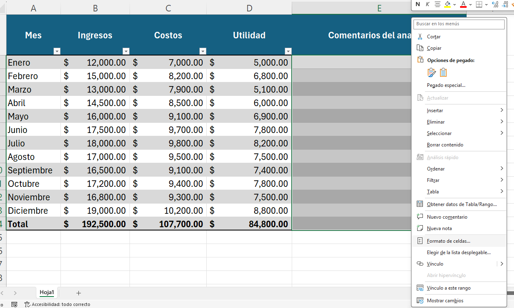
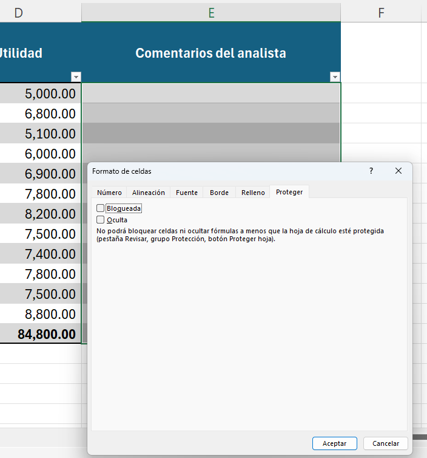
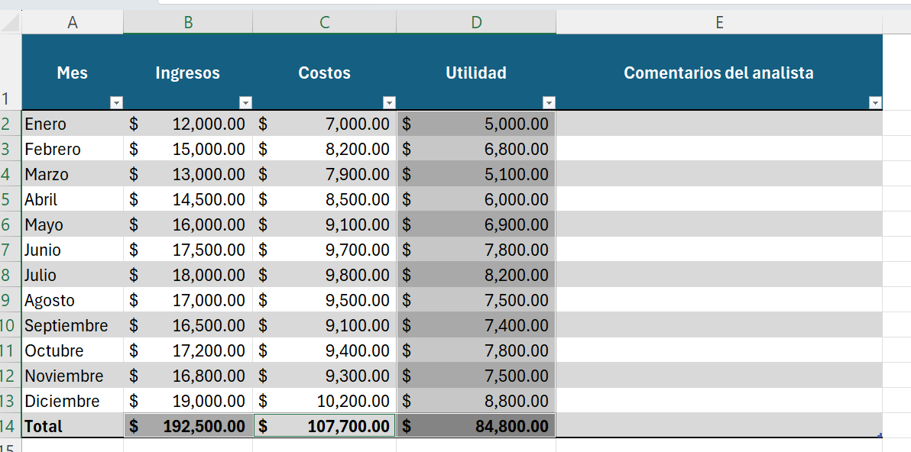
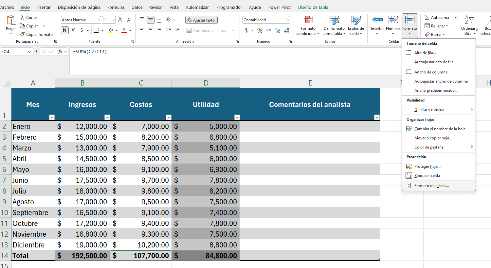
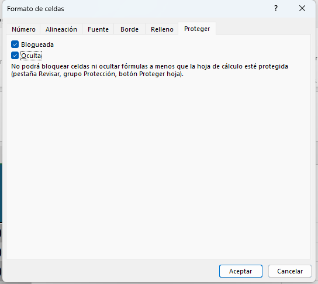
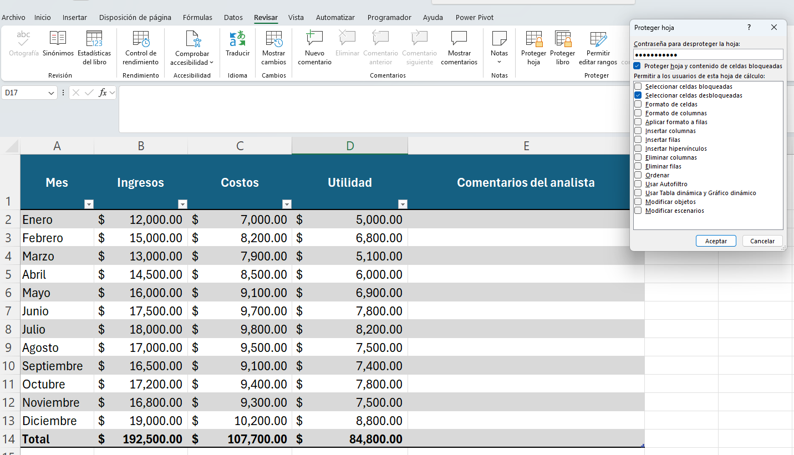
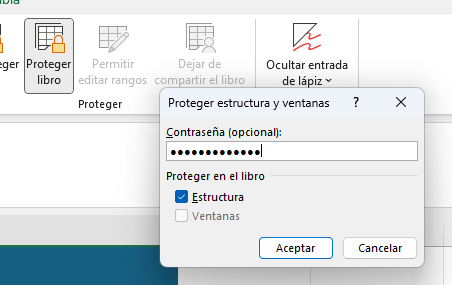
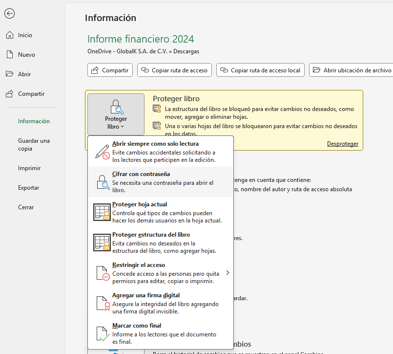
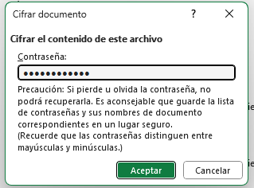
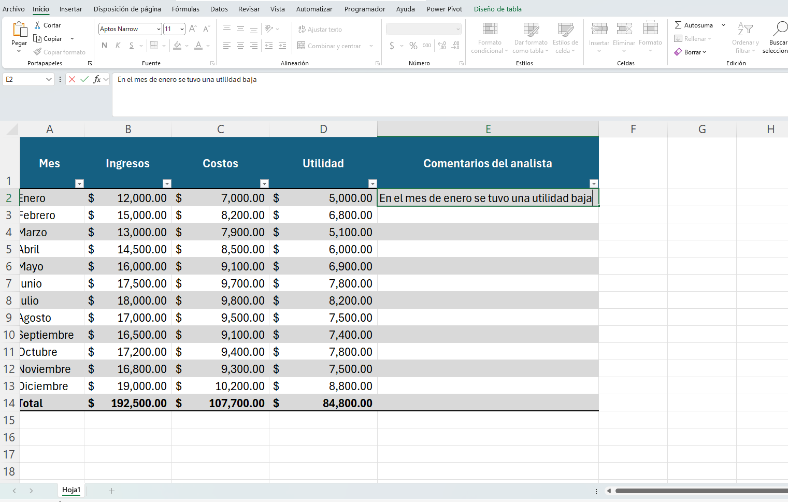

# Control de acceso y protección de datos en un informe financiero

## Objetivo de la práctica:
Al finalizar la práctica, serás capaz de:
- Aplicar la protección de celdas específicas para evitar modificaciones no deseadas.

- Configurar contraseñas para restringir la apertura y edición del archivo.

- Bloquear la estructura del libro para impedir la manipulación de hojas.

- Ocultar fórmulas críticas que contienen cálculos financieros.

- Permitir la edición únicamente en las celdas designadas para entrada de datos.

## Duración aproximada:
- 15 minutos.

## Instrucciones 
<!-- Proporciona pasos detallados sobre cómo configurar y administrar sistemas, implementar soluciones de software, realizar pruebas de seguridad, o cualquier otro escenario práctico relevante para el campo de la tecnología de la información -->
### Tarea 1. Preparar las celdas editables (comentarios)

Paso 1. Abrir el archivo llamado [Informe financiero 2024](<Informe financiero 2024.xlsx>) 

Selecciona el rango $E2:E14$

Paso 2. Haz clic derecho → Formato de celdas → Proteger → desmarca *"Bloqueada"*.

Paso 3. Esto permite que solo esa columna sea editable.

### Tarea 2. Ocultar las fórmulas

Paso 1. Selecciona las celdas con fórmulas: columna D y fila 14 (D2:D14, B14:D14).

Paso 2. Ve a Inicio → Formato de celdas → Protección → Marca "Oculta".

### Tarea 3. Activar la protección de hoja

Paso 1. Ve a Revisar → Proteger hoja.

Paso 2. Marca solo “Seleccionar celdas desbloqueadas”.

Paso 3. Contraseña: Resumen2024

### Tarea 4.  Proteger el libro (estructura)

Paso 1. Ve a Revisar → Proteger libro.

Paso 2. Marca “Estructura” y asigna la contraseña: EstructuraFin

### Tarea 5. Proteger con contraseña el archivo

Paso 1. Ve a Archivo → Información → Proteger libro → Cifrar con contraseña.

Paso 2. Contraseña: Finanzas2024

### Tarea 6. Proteger con contraseña el archivo

Paso 1. Ve a Archivo → Información → Proteger libro → Cifrar con contraseña.

Paso 2. Contraseña: Finanzas2024

Paso 3. Guarda los cambios y cierra el archivo

Paso 4. Abre el archivo ingresa la contraseña y coloca un comentario en la columna comentarios del analista

### Resultado esperado
- Solo se podrán ingresar comentarios en la columna “Comentarios del analista”.

- Las fórmulas estarán ocultas y protegidas.

- No se podrán insertar, eliminar o mover hojas.

- El archivo completo no podrá abrirse o editarse sin contraseña.

