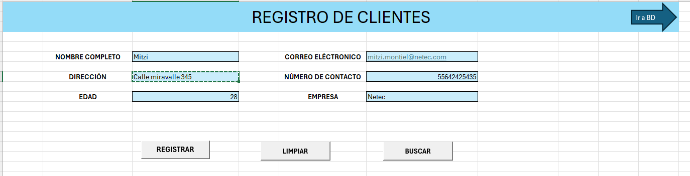
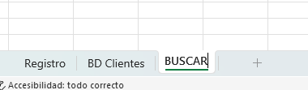
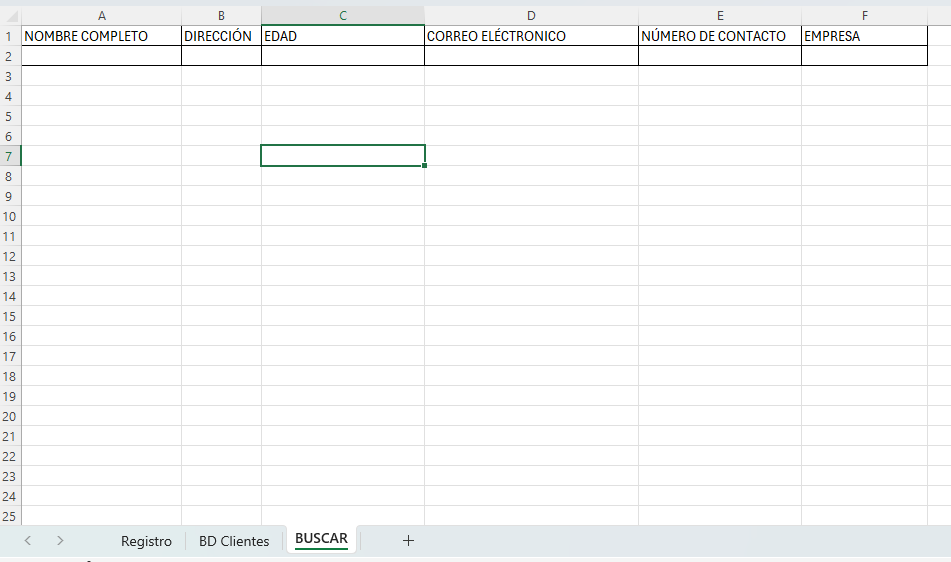
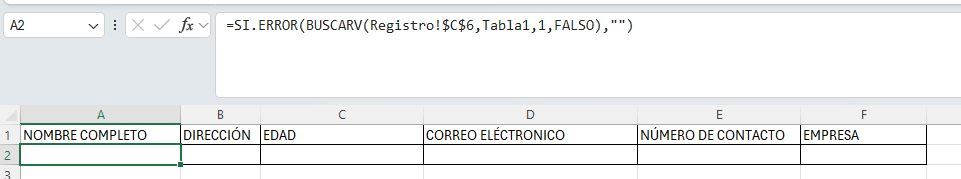
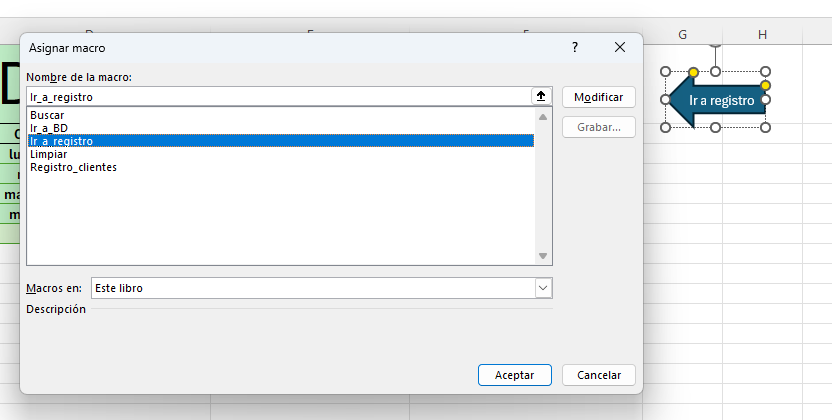

# Práctica 2. Sistema de registro de clientes con macros

## Objetivo de la práctica:
Al finalizar la práctica, serás capaz de:
- Aplicar macros grabadas para automatizar la captura, almacenamiento y búsqueda de datos.
- Desarrollar un sistema funcional de entrada de datos sin programación (usando solo grabadora de macros).
- Usar botones de formulario para ejecutar macros asociadas.
- Consolidar la relación entre formularios de entrada y una base de datos en Excel.

## Duración aproximada:
- 25 minutos.

## Instrucciones 

### Tarea 1. Realizar macro para registrar a clientes
Paso 1. Abrir el archivo llamado [Registro_de_clientes](<Registro de clientes.xlsm>).

Paso 2. Ir a la pestaña de registro, dirigirse a la sección "Programador" y seleccionar "Grabar macro".


Paso 3. Nombrar a la macro como "Registro_clientes".


Paso 4. Al iniciar la grabación, ir a la pestaña "BD Clientes" e insertar una fila nueva debajo de los encabezados.


Paso 5. Posicionarse en la columna A3 de la pestaña BD Clientes.


Paso 6.  Regresar a la pestaña registro, seleccionar la información del campo "NOMBRE COMPLETO" y pegarla solo como valores en la pestaña BD Clientes.


Paso 7. Posicionarse en la columna siguiente de la pestaña BD Clientes.


Paso 8. Ir a la pestaña registro y seleccionar los datos del campo de "DIRECCIÓN".


Paso 9. Ir a la pestaña BD Clientes y pegar solo como valores la información en el campo de "Dirección".


Paso 10. Posicionarse en la columna siguiente en el campo "Edad".


Paso 11. Repetir el proceso con todos los datos. 

Paso 12. Al terminar de pasar todos los datos, dirigirse al campo de "Nombre", seleccionar el filtro y escoger la opción "Ordenar de la A-Z".


Paso 13. Ir a la hoja de registro y dar doble clic en cualquier celda.

Paso 14. En la barra superior, ir a la sección de "Programador" y detener la grabación.

Paso 15. Ir al botón "Registrar" y asignarle la macro "Registro_clientes".


### Tarea 2. Realizar macro para limpiar campos

Paso 1. En la barra superior, ir a la sección de "Programador", seleccionar "Grabar macro" y ponerle el nombre de "Limpiar".


Paso 2. Ir al campo "Nombre" y oprimir el botón *Supr*. 


Paso 3. Realizar la misma acción con cada uno de los campos de la pestaña "Registro clientes".

Paso 4. Asignar la macro al botón de limpiar.


Paso 5. Hacer la prueba ingresando datos y luego usar el botón limpiar.




### Tarea 3. Realiza Macro para buscar datos

Paso 1. Generar una nueva hoja con el nombre de "BUSCAR".

Paso 2. De la hoja BD Clientes seleccionar los campos de la tabla y pegarlos en la hoja de BUSCAR.



Paso 3. Crear una fórmula que se encargará de buscar los datos; basar como criterio de búsqueda el nombre. 
Posicionarse en la columna A2 y escribir la fórmula.

```
=SI.ERROR(BUSCARV(Registro!$C$6,Tabla1,1,FALSO),"")
```




Paso 4. Posicionarse en la fórmula y arrastrarla a la derecha hacia los demás campos. En cada campo se debe cambiar en la fórmula la columna, según corresponda.


Paso 5. Para comprobar su funcionamiento, ir a la pestaña Registro en el campo de "NOMBRE COMPLETO" y poner el nombre de un registro ya conocido. 


Paso 6. Ir a la pestaña Buscar y ver que efectivamente obtiene la información.


Paso 7. Dirigirse a la pestaña "Registro" y en la barra, en el apartado de "Programador", seleccionar "Grabar la macro" con el nombre de "Buscar".


Paso 8. Ir a la celda donde está el campo "DIRECCIÓN"; dirigirse a la hoja de buscar, seleccionar el campo y pegarlo solo como valores en la hoja de Registro.


Paso 9. Posicionarse en el campo de "EDAD"; ir a la hoja de BUSCAR, seleccionar la información de la edad y pegarla solo como valores en la hoja de Registro.


Paso 10. Hacer lo mismo con cada uno de los campos que tenemos con información, al terminar, posicionarse en otra celda cualquiera.

Paso 11. Dirigirse a la barra superior en la sección de "Programador" y detener la macro. 

Paso 12. Asignar la macro al botón de BUSCAR.


### Tarea 4. Quitar el parpadeo de la macro, regitrar y buscar

Paso 1. Ir a la sección de "Programador" en el apartado de Visual Basic.


Paso 2. Donde esta el código de la macro de "Registro_clientes", colocar la siguiente instrucción: 

*Application.ScreenUpdating = False*

Guardar los cambios. 


Paso 3: En el mismo código de esa macro, ir al final y colocar la siguiente linea de código. Guardar los cambios.

*Application.ScreenUpdating = True*


Paso 4: Realizar el mismo proceso con el código de la macro "Buscar".

Pao 5: Probar las macros para comprobar que ya no está el parpadeo.


### Tarea 5. Hacer macro para ir a la base de datos y macro para regresar al registro clientes

Paso 1: En la hoja registro, dirigirse a la pestaña de "Programador", seleccionar Grabar macro y ponerle de nombre "Ir_a_BD".


Paso 2: En la hoja llamada BD_Clientes, seleccionar la celda con el nombre de "BASE DE DATOS".

Paso 3: Detener la macro.

Paso 4: Asignar la macro a la flecha azul de la hoja registro, dar clic derecho a la flecha, asignar macro; escoger la de "Ir_a_BD".


Paso 5: En la hoja llamada BD_Clientes, realizar el mismo proceso, pero ahora para ir a la hoja de regitro.

Paso 6: Grabar la macro con el nombre de "Ir_a_registro".


Paso 7: Cuando inicie la grabación, ir a la hoja "Registro" y dar clic en la celda que tiene el titulo de "Registro de clientes".

Paso 8: Detener la macro y asignarla a la flecha azul de la hoja "BD_Clientes".



### Resultado esperado

El resultado de está práctica es tener 5 macros que funcionan para registrar clientes, limpiar los campos, buscar clientes e ir de una hoja a otra. 


