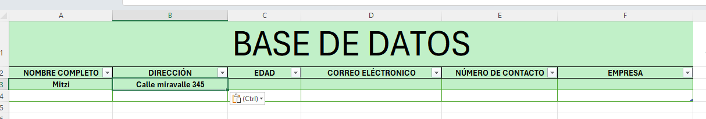
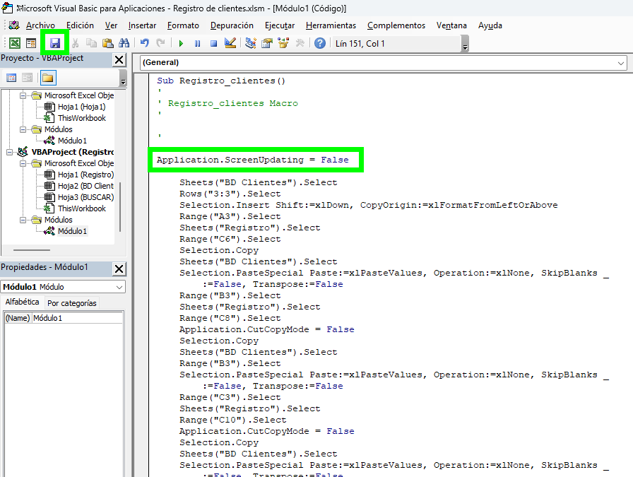
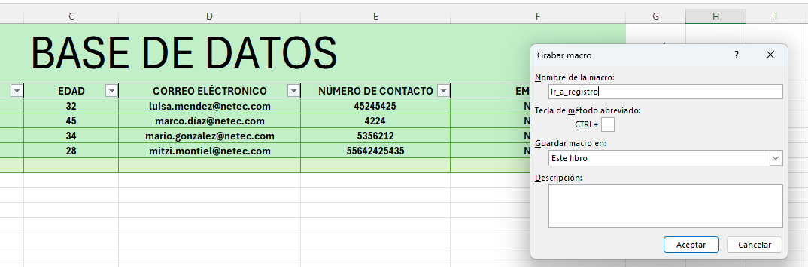

# Sistema de Registro de Clientes con Macros

## Objetivo de la práctica:
Al finalizar la práctica, serás capaz de:
- Aplicar macros grabadas para automatizar la captura, almacenamiento y búsqueda de datos.
- Desarrollar un sistema funcional de entrada de datos sin programación (usando solo grabadora de macros).
- Usar botones de formulario para ejecutar macros asociadas.
- Consolidar la relación entre formularios de entrada y una base de datos en Excel.

## Duración aproximada:
- 25 minutos.

## Instrucciones 

### Tarea 1. Realizar macro para registrar a clientes
Paso 1. Abre el archivo llamado [Registro_de_clientes](<Registro de clientes.xlsm>)
Paso 2. Vamos a la pestaña de registro y nos vamos a la sección *programador* y vamos a *grabar macro*

Paso 3. Nombraremos a la macro como *registro_clientes*

Paso 4. Al iniciar la grabación vamos a la pestaña BD Clientes e insertamos una fila nueva debajo de los encabezados

Paso 3. Nos posicionamos en la columna A3 de la pestaba BD Clientes

Paso 4  Regresamos a la pestaña *Registro*, seleccionamos la información del campo *Nombre completo* y la pegamos solo como valores en la pestaña *BD Clientes*

Paso 5: Nos posicionamos en la pestaña *BD Clientes* en la columna siguiente

Paso 6: Vamos a la pestaña *Registro* y vamos a seleccionar los datos del campo de *Dirección*

Paso 7: Vamos a pestaña BD Clientes y pegamos solo como valores la información en el campo de dirección.

Paso 8: Nos posicionamos en la columna siguiente en el campo edad

Paso 9: Repetimos el proceso con todos los datos 
Paso 10. Al terminar de pasar todos los datos nos vamos al campo de nombre y seleccionamos el filtro y escogemos la opción Ordenar de la A-Z

Paso 11: Vamos a la hoja de registro y damos doble clic en cualquier celda

Paso 12: Vamos a la barra superior a la sección de *Programador y detenemos la grabación

Paso 13: Vamos al botón *Registrar* y le asignamos la macro *Registro_clientes*

### Tarea 2. Realizar macro para limpiar campos

Paso 1: Vamos a la barra superior a la sección de Programador, seleccionamos grabar Macro y le ponemos el nombre de *limpiar*

Paso 2: Vamos al campo nombre y oprimimos el botón *Supr* 

Paso 3: Realizamos la misma acción con cada uno de los campos de la pestaña *Registro clientes*

Pao 4: Asignamos la macro al botón de limpiar

Paso 5: Haz la prueba ingresando datos y luego usa el botón limpiar.

### Tarea 3. Realiza Macro para buscar datos

Paso 1: Vamos a generar una nueva hoja que llamaremos *BUSCAR*

Paso 2: De la hoja *BD Clientes* seleccionamos los campos de la tabla y los pegamos en la hoja de BUSCAR

Paso 3: Vamos a crear una formula que va a buscar los datos, nos vamos a basar como criterio de busqueda el nombre. 
Nos posicionamos en la columna A2 y escribimos la fórmula 
*=SI.ERROR(BUSCARV(Registro!$C$6,Tabla1,1,FALSO),"")*

Paso 4: Nos posicionamos en la formula y la arrastramos a la derecha hacia los demás campos, en cada campo vamos a cambiar en la formula la columna según corresponda

Paso 5: Vamos a probar que funcione, ir a la pestaña registro al campo de nombre completo y ponemos el nombre de un registro que sabemos que tenemos 

Paso 6: Vamos a la pestaña BUSCAR y vemos que efectivamente obtiene la información

Paso 7: Vamos a la pestaña Registro y en la barra en el apartado de programador y vamos a grabar la macro con el nombre de *Buscar*

Paso 8: Vamos a la celda donde está el campo dirección, luego nos vamos a la hoja de Buscar, seleccionamos el campo y lo pegamos solo como valores en la hoja de Registro.

Paso 9: Vamos ahora al campo de EDAD, nos posicionamos y vamos ahora ala hoja de BUSCAR, seleccionamos la información de la edad y la pegamos solo como valores en la hoja de Registro.

Paso 10: Hacemos lo mismo con cada uno de los campos que tenemos con información hasta terminar no posicionamos en otra celda cualquiera.

Paso 11: Vamos a la barra superior en la sección de programador y detenemos la macro. 

Paso 12: Asignamos la macro al botón de BUSCAR.

### Tarea 4. Quitar el parpadeo de la macro regitrar y buscar

Paso 1 Vamos a la pestaña programador en el apartado de Visual Basic.

Paso 2: Donde esta el código de la macro de Registro_clientes colocar la siguiente instruscción: 

*Application.ScreenUpdating = False*

Guardamos los cambios 

Paso 3: En el mismo código de esa macro vamos al final y colocamos está linea de código y guardamos los cambios.

*Application.ScreenUpdating = True*

Paso 4: Hacemos lo mismo con el código de la macro *Buscar*

Pao 5: Prueba las macros para comprobar que ya no está el parpadeo

### Tarea 5. Hacer macro para ir a la base de datos y macro para regresar al registro clientes

Paso 1: Vamos a la hoja registro, a la pestaña de *programador* seleccionamos grabar macro y le ponemos de nombre *Ir_a_BD*

Paso 2: Vamos a ir a la hojoa llamada BD_Clientes y seleccionamos la celda con el nombre de BASE DE DATOS

Paso 3: Detenemos la macro.

Paso 4: Asigmamos la maco a la flecha azul de la hoja registro , damos clic derecho a la flecha, asignar macro y escogemos la de Ir_a_BD

Paso 5: Vamos a la hoja llamada *BD_Clientes* y realizamos el mismo proceso pero ahora para ir a la hoja de regitro.

Paso 6: Grabamos la macro con el nombre de *Ir_a_registro*

Paso 7: Cuando inicie la grabación vamos a la hoja *Registro* y damos clic en la celda que tiene el titulo de *registro de clientes*

Paso 8: Detenemos la macro y la asignamos a la flecha azul de la hoja *BD_Clientes*

### Resultado esperado

El resultado de está práctica es tener 5 macros que funcionan para registrar clientes, limpiar los campos, buscar clientes, ir de una hoja a otra. 

