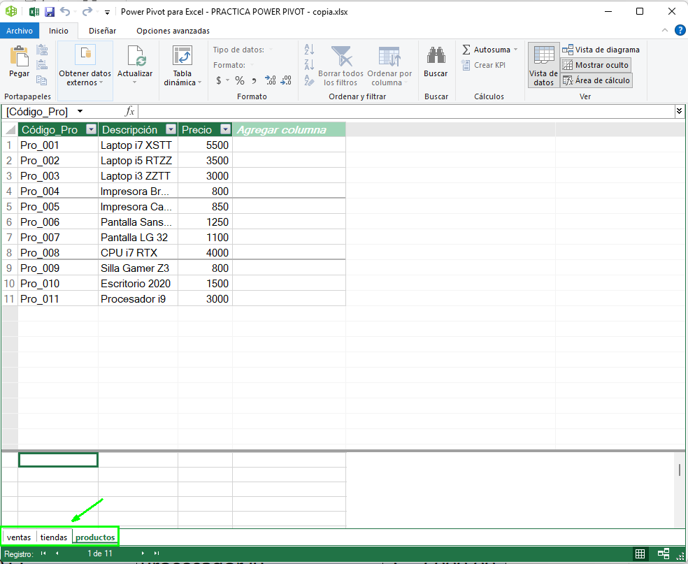
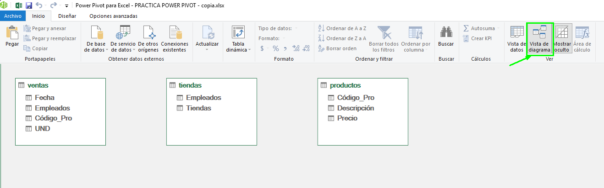

# Práctica 3.1. Modelo de datos con Power Pivot ()

## Objetivo de la práctica:
Al finalizar la práctica, serás capaz de:
- Comprender el proceso de agregar y relacionar múltiples tablas en Power Pivot para crear un modelo de datos integrado.
- Aprender a usar Power Pivot para crear una tabla dinámica basada en datos relacionados de múltiples tablas.

## Duración aproximada:
- 10 minutos.

## Escenario:
Eres un analista de datos en una empresa que maneja grandes volúmenes de información sobre ventas, productos y tiendas. Recientemente, has notado que el manejo de estos datos en hojas de Excel individuales resulta lento y complicado. Por ello, decides usar Power Pivot para integrar y relacionar estas tablas, permitiendo un análisis más fluido y eficiente.

## Instrucciones 

### Tarea 1. Agregar tablas al modelo de datos

Paso 1. Descargar y guardar el siguiente archivo llamado: [Modelos_con_Power_Pivot](Modelos_con_Power_Pivot.xlsx). 

Paso 2. Dirigirse a la pestaña "Ventas", posteriormente, seleccionar Power Pivot en la barra superior y hacer clic en "Agregar a modelo de datos" .

Verás que se despliega el editor de Power Pivot.


Paso 3. Minimizar la pantalla y hacer lo mismo con la pestaña de "Tiendas" y "Productos".


Veras en el editor de Power Pivot las tres pestañas de cada modelo de datos agregado.




### Tarea 2. Relacionar las tablas en Power Pivot

Paso 1. Ir a la vista de diagrama:

- En la ventana de Power Pivot, hacer clic en "Vista de diagrama".
- Aparecerán las tres tablas cargadas con sus encabezados visibles.



Paso 2. Relacionar la tabla de Ventas con la de Productos:
- Identificar la columna "Código de Producto" en ambas tablas.
- Arrastrar la columna Código de Producto de la tabla de Ventas hacia la columna correspondiente en la tabla de Productos.

> Nota: Considera que puedes arrastrar las tablas según tu preferencia.

Verificar que la relación se haya creado.


Paso 3. Relacionar la tabla de Ventas con la de Tiendas:
- Encontrar la columna "Empleado" en la tabla de Ventas y la columna "Empleado" en la tabla de Tiendas.
- Arrastrar la columna Empleado de la tabla de Ventas hacia la columna en la tabla de Tiendas.


- Asegúrate de que la relación sea correcta.

### Tarea 3. Crear una tabla dinámica en Power Pivot

Paso 1. Insertar una tabla dinámica:
- En la ventana de Power Pivot, seleccionar "Tabla dinámica" en la parte superior.


- Elegir "Nueva hoja de cálculo" para que la tabla dinámica se inserte en una hoja nueva en Excel.

Paso 2. Agregar campos a la tabla dinámica:
- En la lista de campos de la tabla dinámica, seleccionar "Tienda" de la tabla de "Tiendas" y colocarla en el área de "Filas".
- Agregar "Descripción del Producto" de la tabla de Productos al área de Filas debajo de Tienda.
- Añadir "Unidades" de la tabla de Ventas al área de "Valores". 


Paso 3. Guardar los cambios realizados y cerrar el archivo.

### Resultado esperado


# Práctica 3.2. Filtrado interactivo de ventas con segmentación en Power Pivot 

## Objetivo de la práctica:
Al finalizar la práctica, serás capaz de:

- Crear una tabla dinámica basada en el modelo de datos para analizar ventas de forma detallada por empleado y categoría de producto.
- Aplicar segmentaciones de datos para filtrar dinámicamente los resultados en la tabla dinámica, mejorando la interacción y el análisis visual.

## Duración aproximada:
- 15 minutos.

## Instrucciones 

### Tarea 1. Generar modelo de datos

Paso 1: Descargar el archivo llamado [Práctica_2_módulo_3](práctica_módulo_3_parte_2.xlsx).

Paso 2: En la pestaña "Empleados" seleccionar la tabla y en la parte superior ir a Power Pivot. Dar clic en "Agregar a modelo de datos".


Confirmar.


Paso 3. Cerrrar la hoja y repetir lo mismo con cada una de las tablas de la pestaña "Ventas" y "Categoría".


Paso 4. Una vez que ya estan todas las tablas en Power Pivot, cambiar los nombres de las tablas dando clic derecho en la opción "Cambiar nombre".


Los nombre deben quedar de la siguiente manera: 


Paso 5. Ir a la opción de "Vista de diagrama" en Power Pivot.


Paso 6. Crear las relaciones de la siguiente manera: 
- Tabla empleados (código) va a unirse a tabla ventas (código).
- Tabla Ventas (categoría) va a unirse a tabla categoría (categoría).


### Tarea 2. Crear una tabla dinánmica

Paso 1. En la barra superior seleccionar tabla dinámica.


Paso 2. Seleccionar una nueva hoja de calculo.


Paso 3. La tabla dinámica quedará en la columna del campo de "Nombre" que está en la tabla Empleados.
Las filas quedarán con el campo Fecha (de la tabla Ventas), Categoría (de la tabla Categoría) y Productos (de la tabla Ventas).

En valores quedará la suma del campo total que está en la tabla "Ventas".


Paso 4. Ir a la celda donde aparece la primera fecha que es 04/05/2020,
dar clic derecho y seleccionar "Agrupar".


Seleccionar la opción de "Meses" y aceptar.


Paso 5. Seleccionar una celda de la columna del "Total general", hacer clic derecho y dirigirse a "Formato número".


Pao 6. Seleccionar el formato moneda y las posiciones decimales 0.


### Tarea 3. Insertar segmentadores

Paso 1. Posicionarse en la tabla dinámica y dirigirse a la barra superior, en la opción de "Analizar tabla dinámica" seleccionar "Insertar segmentación de datos".


Paso 2. En la tabla "Categoría" seleccionar la opción categoría. Y en la tabla "Ventas" seleccionar productos.


Paso 3. En los segmentadores insertados, seleccionar "Consumo básico", "Azúcar" y "Café".

Paso 4: Guardar los cambios realizados y cerrar el archivo.

> *Nota:* Si deseas, puedes cambiar el color de los segmentadores o de la tabla dinámica. Para esto hay que ir a la opción Diseño.


### Resultado esperado


# Práctica 3.3. Evaluación de Ventas con KPIs en Power Pivot

## Objetivo de la práctica:
Al finalizar la práctica, serás capaz de:

- Integrar datos comerciales al modelo de Power Pivot.
- Crear una medida DAX que calculé el promedio de ventas por operación.
- Construir un KPI visual para evaluar el cumplimiento de metas de venta por producto.
- Analizar gráficamente los resultados mediante una tabla dinámica.

## Duración aproximada:
- 15 minutos.

## Escenario:
Trabajas en el área de inteligencia comercial de una empresa dedicada a la distribución de tecnología, mobiliario y telecomunicaciones a nivel nacional. Cada venta tiene un valor considerable, ya que se trata de productos empresariales.

La gerencia solicita un informe visual que indique qué productos están cumpliendo con el objetivo de ventas promedio por operación, fijado en $6,000 MXN.

Para ello, vas a construir un KPI con Power Pivot, el cual te permitirá visualizar este rendimiento con indicadores de color.

## Instrucciones 

### Tarea 1. Cargar los datos al modelo de Power Pivot

Paso 1. Descargar y abrir el archivo [Práctica_módulo_3_ parte_3](práctica_módulo3_parte_3.xlsx).

Paso 2. Convertir los datos en una tabla (Crtl + T) y nombrarla "VentasKPI".


Paso 3. Ir a la pestaña Power Pivot > Agregar al modelo de datos.


### Tarea 2. Crear una medida de promedio de venta

Paso 1. Dar formato de moneda a la columna Precio y columna Total.


Paso 2. En el "Área de cálculo", crear una medida con la siguiente formula:


```
*PromedioVenta := AVERAGE(VentasKPI[Total])*
```


Paso 3. Para dar formato al promedio de venta, hacer clic derecho en la opción de "Formato" y seleccionar Moneda, Simbolo $ y Posiciones decimales 1.


### Tarea 3. Crear el KPI

Paso 1. Seleccionar la medida de PromedioVenta.
Paso 2. Hacer clic en "Crear KPI" en la pestaña de Inicio de Power Pivot.


Paso 3. Configurar el KPI así:

Valor objetivo absoluto: 6000

Indicadores de estado:

🔴 Rojo si < 4000

🟡 Amarillo si entre 4000 y 6000

🟢 Verde si > 6000

Paso 4. Confirmar con Aceptar.


### Tarea 4. Crear una tabla dinámica para visualizar

Paso 1. Regresar a la hoja de Excel donde esta la tabla y seleccionar la opción de insertar "Tabla dinámica", hacer clic en la opción de "Desde modelo de datos" y en una nueva hoja. 


Paso 2. En la tabla dinámica:

- Agregar Producto a Filas.

- Agregar a Valores:
    - Promedio de venta.
    - Estado del KPI (el icono visual).


Paso 3. Guardar los cambios y cerrar el libro.

### Resultado esperado

