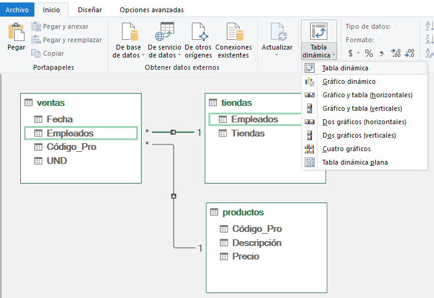

# Nombre del laboratorio 

## Objetivo de la práctica:
Al finalizar la práctica, serás capaz de:
- Objetivo1
- Objetivo2
- Objetivo3

## Duración aproximada:
- xx minutos.

## Escenario:
Eres un analista de datos en una empresa que maneja grandes volúmenes de información sobre ventas, productos y tiendas. Recientemente, has notado que el manejo de estos datos en hojas de Excel individuales resulta lento y complicado. Por ello, decide usar Power Pivot para integrar y relacionar estas tablas, permitiendo un análisis más fluido y eficiente.

## Instrucciones 

### Tarea 1. Agregar tablas al modelo de datos

Paso 1. Descarga y guarda el siguiente archivo llamado: [Modelos_con_Power_Pivot](Modelos_con_Power_Pivot.xlsx) 

Paso 2. Dirígete a la pestaña Ventas, posteriormente en la barra superior selecciona Power Pivot y selecciona Agregar a modelo de datos 

Verás que se despliega el editor de Power Pivot

Paso 3. Minimizar la pantalla y hacer lo mismo con la pestaña de Tiendas y Productos

Veras en el editor de Power Pivot las tres pestañas de cada modelo de datos agregado.

### Tarea 2. Relacionar las tablas en Power Pivot

Paso 1. Ir a la vista de diagrama:

* En la ventana de Power Pivot, haz clic en Vista de diagrama.
* Aparecerán las tres tablas cargadas con sus encabezados visibles

Paso 2. Relacionar la tabla de Ventas con la de Productos:
- Identifica la columna Código de Producto en ambas tablas.
- Arrastra la columna Código de Producto de la tabla de Ventas hacia la columna correspondiente en la tabla de Productos.

*Nota:* Considera que puedes arrastrar las tablas según tu preferencia.

Verifica que la relación se haya creado.

Paso 3. Relacionar la tabla de Ventas con la de Tiendas:
- Encuentra la columna Empleado en la tabla de Ventas y la columna Empleado en la tabla de Tiendas.
- Arrastra la columna Empleado de la tabla de Ventas hacia la columna en la tabla de Tiendas.

- Asegúrate de que la relación sea correcta.

### Tarea 3. Crear una tabla dinámica en Power Pivot

Paso 1. Insertar una tabla dinámica:
- En la ventana de Power Pivot y selecciona Tabla dinámica en la parte superior.

- Elige Nueva hoja de cálculo para que la tabla dinámica se inserte en una hoja nueva en Excel.

Paso 2. Agregar campos a la tabla dinámica:
- En la lista de campos de la tabla dinámica, selecciona Tienda de la tabla de Tiendas y colócala en el área de Filas.
- Agrega Descripción del Producto de la tabla de Productos al área de Filas debajo de Tienda.
Añade Unidades de la tabla de Ventas al área de Valores. 

### Resultado esperado

