# Práctica 4.1. Unificación de nombres en una celda utilizando Power Query

## Objetivo de la práctica:
Al finalizar la práctica, serás capaz de:

- Aprender a utilizar Power Query para combinar columnas de texto en una sola celda y formatear los datos de manera eficiente. En este caso, unificar los campos de Nombre, Apellido Paterno y Apellido Materno en una nueva columna denominada Nombre Completo.

## Duración aproximada:
- 10 minutos.

---

**[⬅️ Atrás](https://netec-mx.github.io/EXC_COP_ADV/Cap%C3%ADtulo3/)** | **[Lista General](https://netec-mx.github.io/EXC_COP_ADV/)** | **[Siguiente ➡️](https://netec-mx.github.io/EXC_COP_ADV/Cap%C3%ADtulo5/)**

---

## Escenario:
Tienes una base de datos de clientes donde los campos Nombre, Apellido Paterno y Apellido Materno están separados en distintas columnas. Sin embargo, para algunos informes, necesitas consolidar el nombre completo de cada cliente en una sola celda. En lugar de hacerlo manualmente, utilizarás Power Query para automatizar este proceso, combinando estos campos en una nueva columna llamada Nombre Completo.

Este procedimiento es útil en situaciones comunes, como la preparación de listas de correos electrónicos, informes de clientes o el análisis de datos, donde es necesario presentar el nombre completo de cada persona de manera clara y organizada.

## Instrucciones 

### Tarea 1. Cargar los datos

Paso 1. Descargar y guardar el siguiente archivo llamado:  [Registro clientes](<Registros clientes (módulo 4).csv>)
el cual está en formato csv.

Se pueden observar las columnas separadas de Nombre, Apellido Paterno y Apellido Materno.

Paso 2. Dirigirse a la pestaña Datos > Obtener datos > Desde archivo > De texto/CSV.

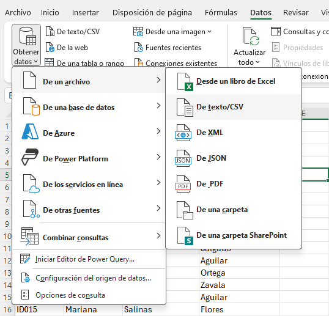

Paso 3. Seleccionar el archivo Registro Clientes, el cual contiene los nombres, apellidos paternos y maternos.

Paso 4. En el panel del Navegador, seleccionar la tabla que contiene estos datos y hacer clic en "Transformar datos" para abrir el editor de Power Query.

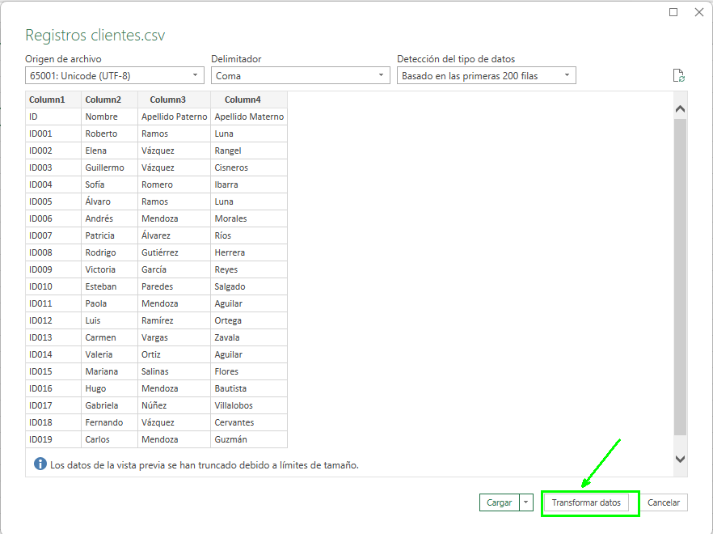

### Tarea 2. Combinar columnas

Paso 1. En el editor de Power Query, hacer clic en el cuadro izquierdo que aparece al lado de la Column1 y seleccionar la opción de "Usar la primera fila como encabezado".

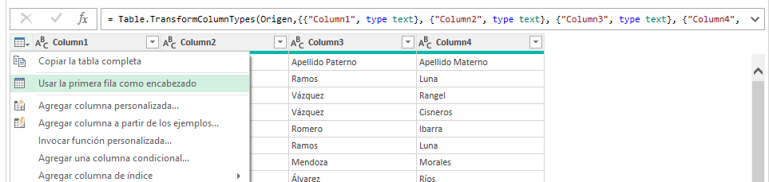

Paso 2. Seleccionar las 3 columnas que traen información del nombre y los apellidos.

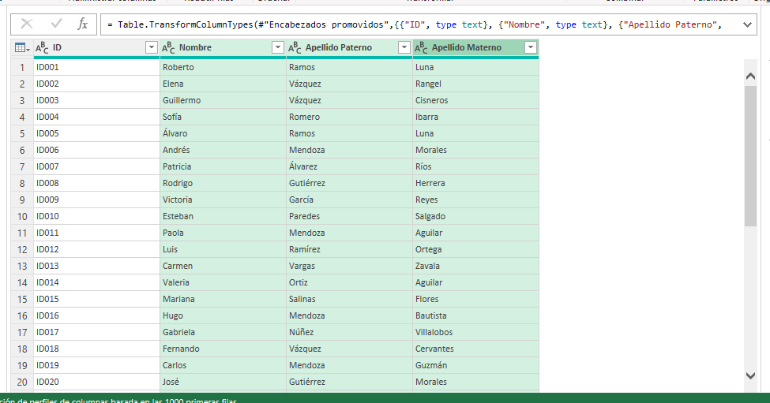


Paso 3. Hacer clic derecho y seleccionar "Combinar columnas".

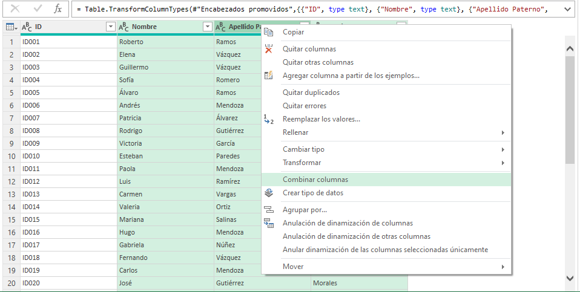

Paso 4. Elegir como separador la opción de "Espacio" y, en "Nuevo nombre de columna", escribir: *Nombre completo*

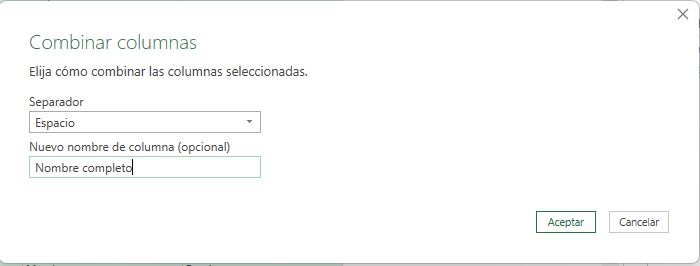

Paso 5. Seleccionar la columa ID, hacer clic derecho y removerla.

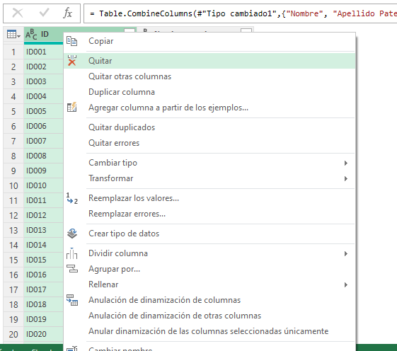

Paso 6. Seleccionar la columna Nombre completo y dar clic en "Cerrar y cargar en".


Paso 7. Dejar marcada la opción "Tabla"; adicionalemente, marcar la opción de "Hoja de cálculo existente", seleccionar la celda E1 y dar clic en Aceptar.


Paso 8. Como resultado, se obtiene la nueva columna de "Nombre completo", únicamente hay que darle el mismo formato que a la tabla original.

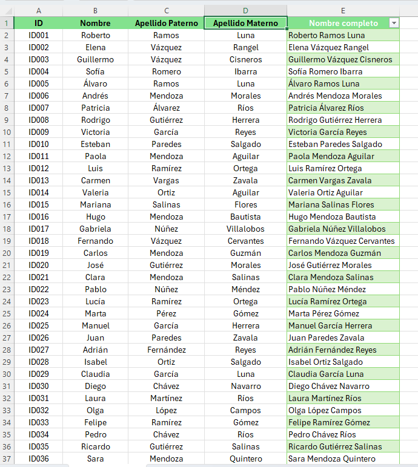

Paso 9. Guardar los cambios y cerrar el archivo.

### Resultado esperado


# Práctica 4.2. Segmentación inteligente de clientes con Power Query

## Objetivo de la práctica:
Al finalizar la práctica, serás capaz de:
- Importar correctamente un archivo CSV.
- Corregir y confirmar el tipo de datos de cada columna.
- Aplicar una columna personalizada con una clasificación más avanzada.
- Cargar el resultado limpio a Excel.

## Duración aproximada:
- 15 minutos.

## Escenario: 
Formas parte del equipo de análisis comercial de una cadena de tiendas a nivel nacional.
El departamento de ventas ha generado un archivo con información detallada de compras de clientes durante el primer trimestre del año. Tu tarea consiste en limpiar los datos y clasificar a los clientes según su nivel de compra, para identificar perfiles de consumo y preparar futuras campañas de marketing segmentado.

Este análisis permitirá detectar:

- Clientes de alto valor (VIP) que merecen atención especial.
- Clientes promedio (Premium y Regular).
- Clientes con bajo nivel de compra (Básico) para estrategias de retención.

## Instrucciones 

### Tarea 1. Importar el archivo CSV en Power Query
Paso 1. Descargar el archivo llamado [BD_Clientes](BD_Clientes_Power_Query.csv).
Paso 2. Abrir un libro de Excel. Guardarlo con el nombre de "Práctica módulo 4".

Paso 3. Ir a Excel → Datos > Obtener datos > Desde archivo > Desde texto/CSV.
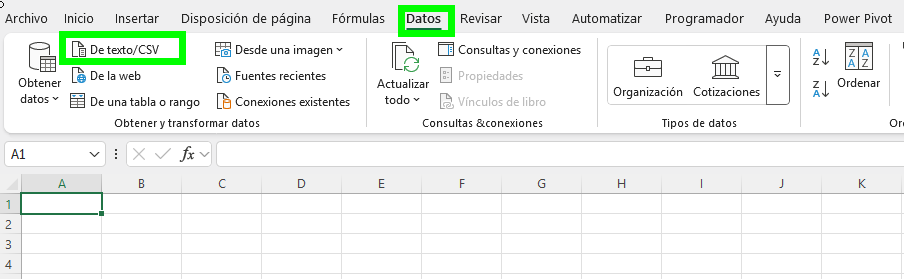

Paso 4. Seleccionar el archivo CSV previamente descargado e importar.
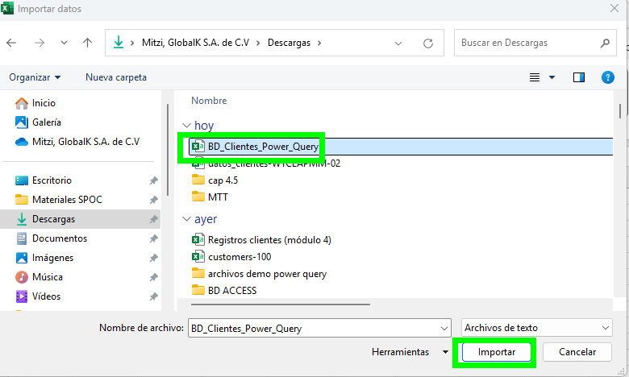

Paso 5. Seleccionar la opción de "Transformar datos".
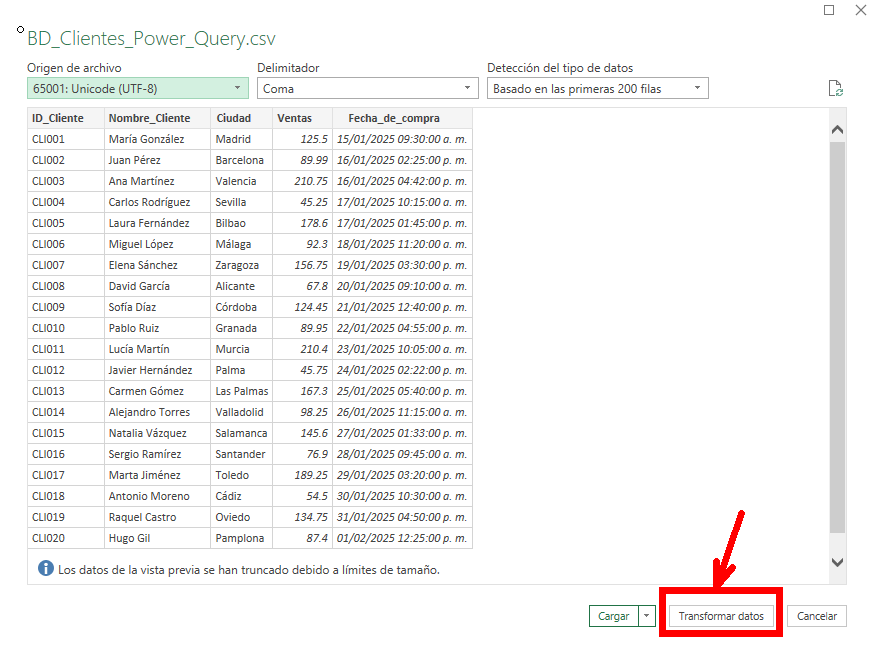


### Tarea 2. Verificar y corregir tipos de datos

Paso 1. Revisar que la columna "ID_Cliente", "Nombre_Cliente" y "Ciudad" esten en formato "Texto".

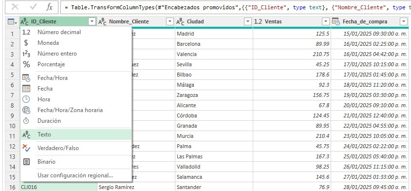


Paso 2. Revisar que la columna "Ventas" este en formato "Número decimal".

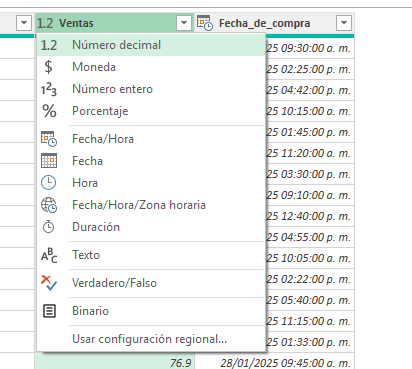


Paso 3. Revisar que "Fecha_de_compra" este en formato "Fecha/Hora", (si aparece como texto cambiarlo a fecha).

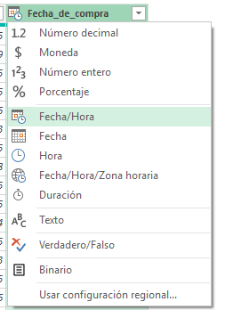


### Tarea 3. Crear columna personalizada (clasificación avanzada)

Paso 1. Dirigirse a Agregar columna > Columna personalizada.
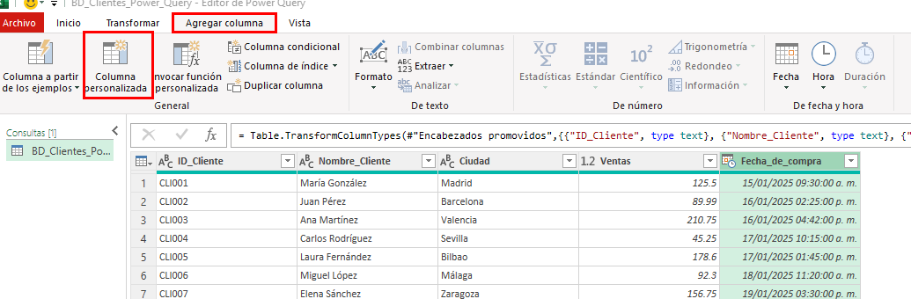

Paso 2. Nombrarla "Clasificación_Cliente".

Usar la siguiente fórmula en lenguaje M: 

```
if [Ventas] >= 200 then "🔝 VIP"
 else if [Ventas] >= 150 then "⭐ Premium"
 else if [Ventas] >= 100 then "✔️ Regular"
 else "📉 Básico"
```

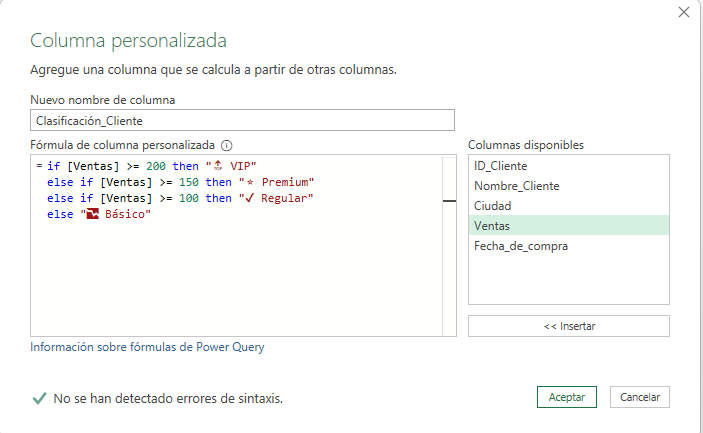

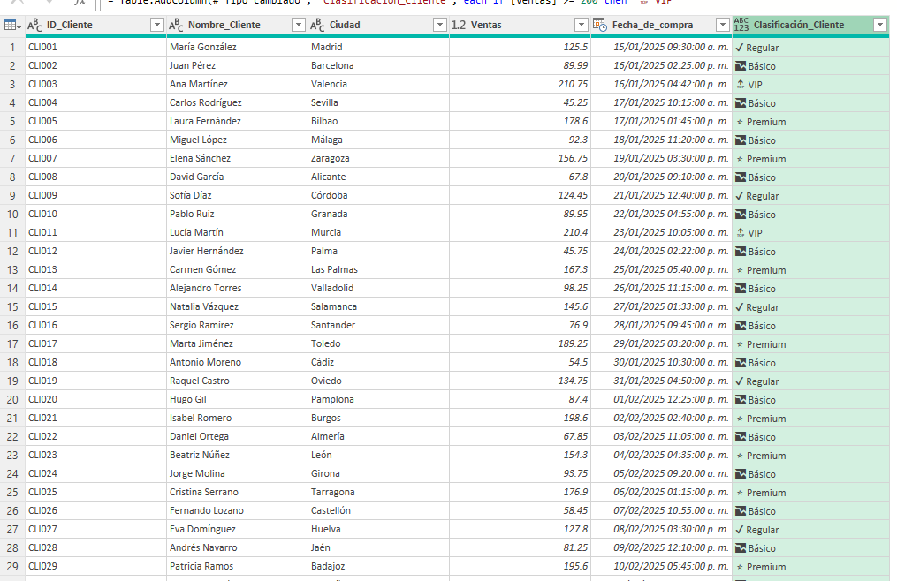


### Tarea 4. Renombrar columnas

Paso 1. Para mayor claridad, renombrar la columna "Fecha_de_compra" por "Fecha".
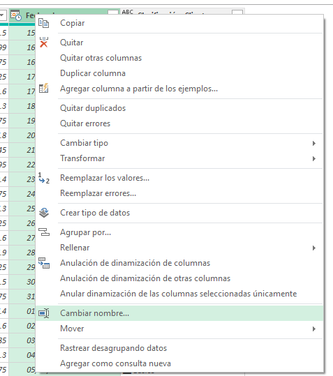

Paso 2. Hacer lo mismo para la columna "Nombre_Cliente", dar clic derecho posicionado sobre la columna.

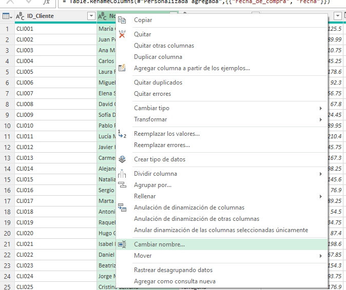

### Tarea 5. Cargar datos a excel

Paso 1. Hacer clic en inicio y seleccionar "Cerrar y cargar".

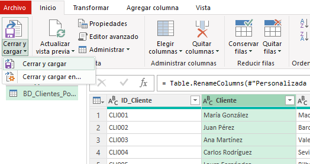

Paso 2. Guardar los cambios realizados y cerrar el archivo.

### Resultado esperado

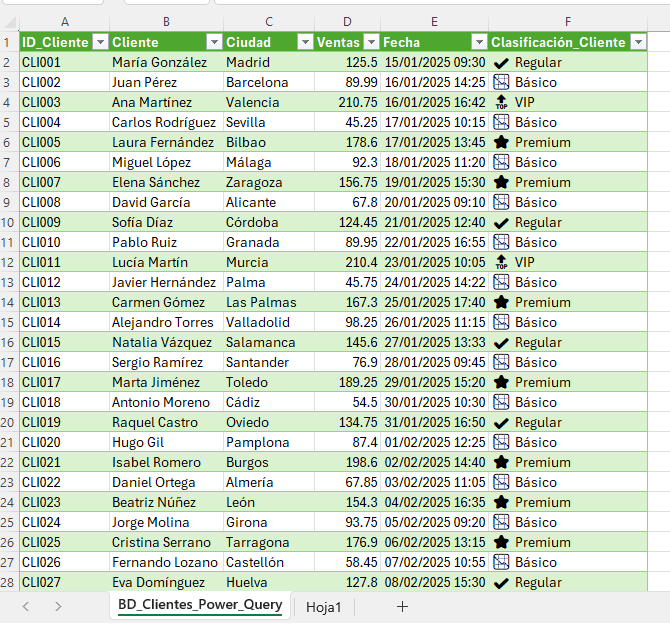


