# Práctica 5. Alerta por stock bajo en inventario con Power Automate

## Objetivo de la práctica:
Al finalizar la práctica, serás capaz de:
- Leer registros de una tabla de Excel desde OneDrive.
- Evaluar una condición basada en un valor numérico (Stock actual < Stock mínimo).
- Enviar una alerta personalizada al encargado de inventario.
- Formatear y presentar valores numéricos correctamente en el correo.

## Duración aproximada:
- 20 minutos.

---

**[⬅️ Atrás](https://netec-mx.github.io/EXC_COP_ADV/Cap%C3%ADtulo4/)** | **[Lista General](https://netec-mx.github.io/EXC_COP_ADV/)** | **[Siguiente ➡️](https://netec-mx.github.io/EXC_COP_ADV/Cap%C3%ADtulo6/)**

---

## Escenario:
Formas parte del equipo de logística de una empresa.
Llevan el inventario en una tabla de Excel con columnas como producto, stock actual, y stock mínimo.
Tu objetivo es configurar un flujo que revise diariamente esa tabla y envíe una alerta automática si algún producto está por debajo del stock mínimo.

## Instrucciones 

### Tarea 1. Crear el archivo en Excel y subirlo a OneDrive

Paso 1. Generar la siguiente tabla de inventario en Excel, ya sea en Excel Online o en tu máquina, y subirlo a OneDrive.

> Nota: En el correo del encargado, coloca tu correo ya que aquí se hará el envío de correo para está práctica.

ID| Producto	| Stock actual	| Stock mínimo	| Encargado

1| 	Laptops Dell| 	   8	        | 10            |mitzi.montiel@netec.com

2| 	Ratones   | 25	                | 20            |mitzi.montiel@netec.com

3| 	Cables HDMI| 4              | 10            |mitzi.montiel@netec.com

4| 	Memorias USB| 	16          | 8             |mitzi.montiel@netec.com

5| 	Sillas ergonomicas| 16      | 15            |mitzi.montiel@netec.com

6| 	Proyectores| 11	            |15	            |mitzi.montiel@netec.com

7| 	Cargadores universales| 7   |7              |mitzi.montiel@netec.com

Paso 2. Insertar el formato tabla.

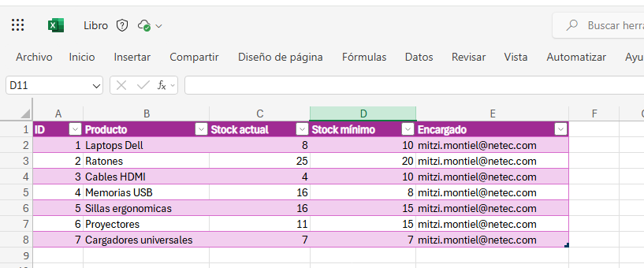

Paso 3. Guardar el archivo como $Inventario$.

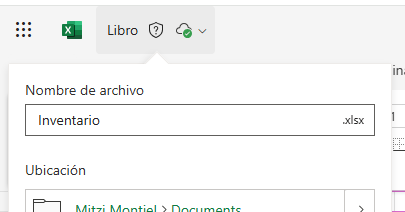

### Tarea 2. En Power Automate, crea un flujo programado

Paso 1. Ingresar a https://make.powerautomate.com 

Paso 2. Seleccionar la opción "Flujo de nube programado".
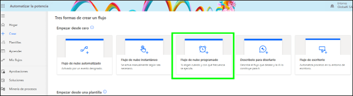

Paso 3. Añadir un nombre como "Alerta por stock bajo".

Paso 4. En la frecuencia escojer "Cada día".

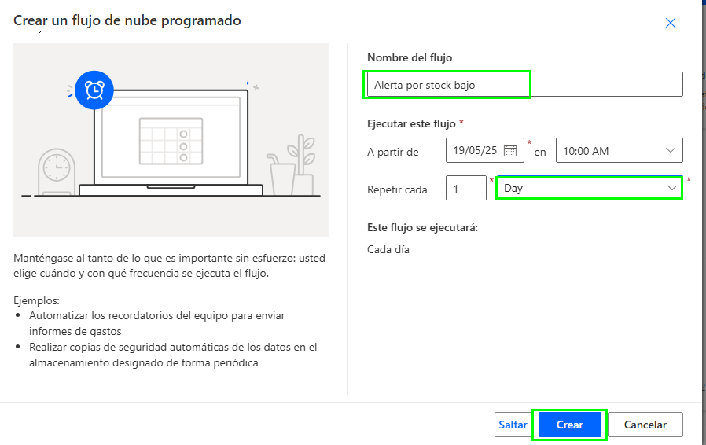

 ### Tarea 3. Agrega acción: “List rows present in a table”

 Paso 1. Dar clic en el simbolo "+" para añadir una acción.

 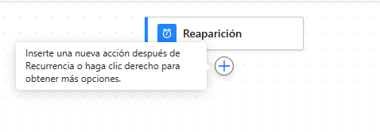

 Paso 2. Buscar la opción "List rows present in a table".

  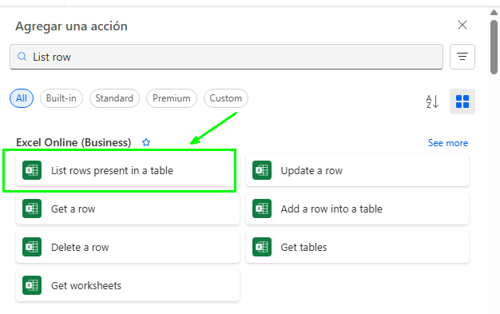

Paso 3. Llenar los campos con la siguiente información:

- Ubicación: One Drive for Bussines
- Biblioteca de documentos: Documentos
- Archivo: Inventario.xlsx
- Tabla: Tabla1
  
  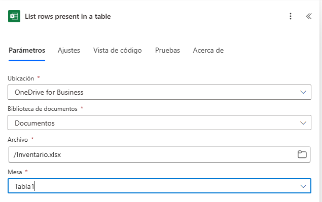

### Tarea 4. Agrega "Apply to each"

Paso 1. Dar clic en insertar una acción en el cuadro de "Listar filas presentes en una tabla".

  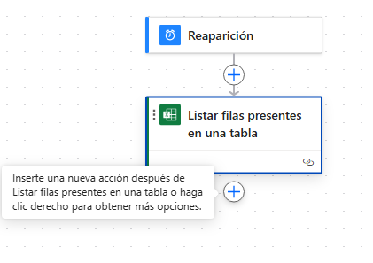

Paso 2. Buscar "Apply to each".

  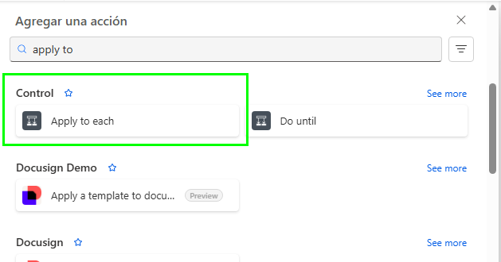

Paso 3. Valor de entrada: "value" 

  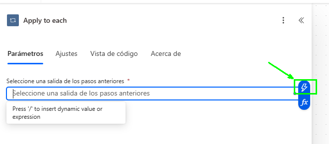

Paso 4. Seleccionar "cuerpo/valor".

  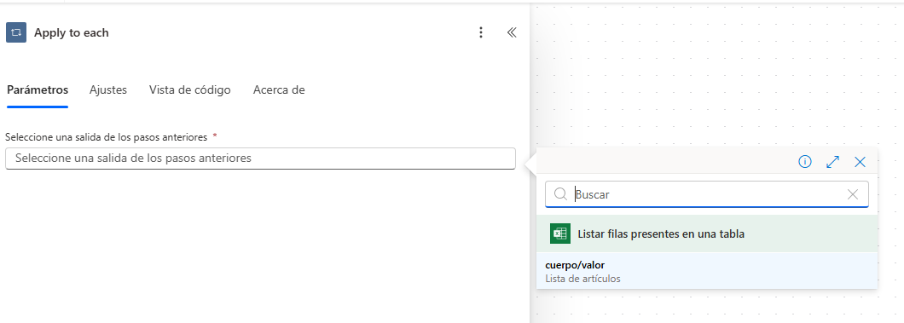

### Tarea 5. Agrega una condición

Paso 1. Dentro del ciclo añadir una acción.

  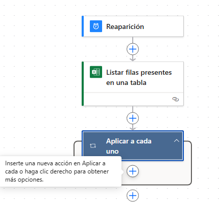

Paso 2. Buscar "Condition".

  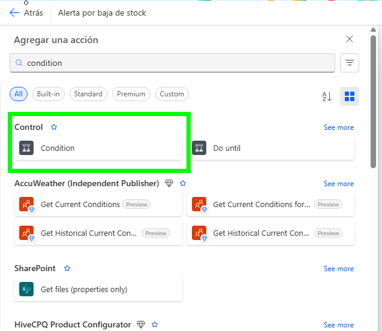

Paso 3. En Choose a value, seleccionar "Stock actual".

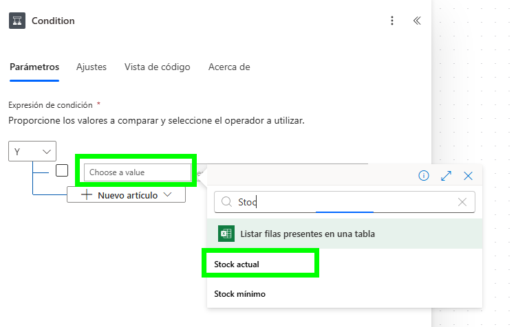

Paso 4. Seleccionar la opción "is less than" y también "Stock mínimo".

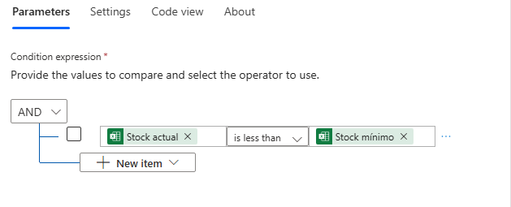

### Tarea 6. En el bloque “True”, agrega: Enviar un correo (V2)

Paso 1. En el bloque de "True" agregar una acción.

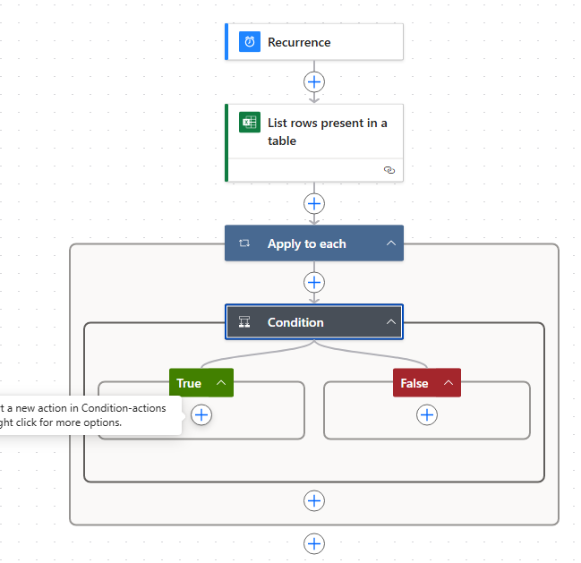

Paso 2. Buscar la acción de "Send an email (V2)".

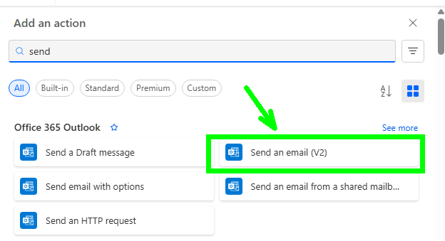

Paso 3. Llenar los valores de la siguiente manera.

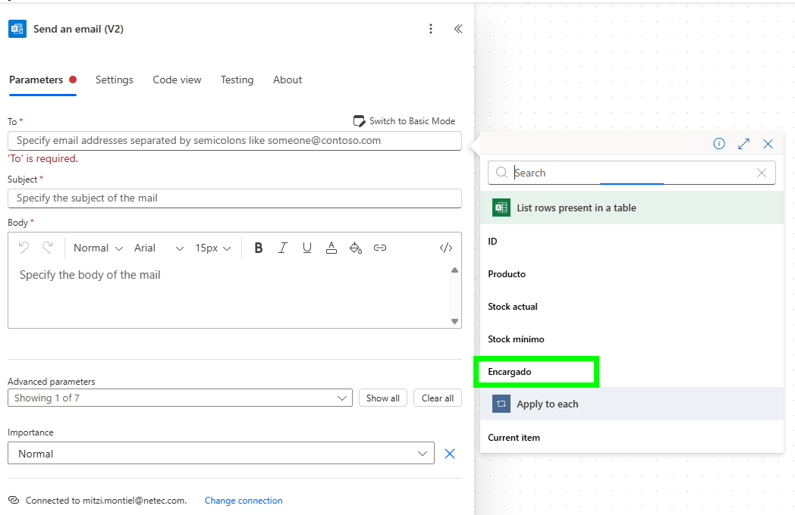

$Para:$ valor de la columna "Encargado".

$Subject:$ ⚠️ Stock bajo detectado 

$Body:$

Hola,

Se ha detectado un producto con stock bajo:

📦 Producto:   @{items('Apply_to_each')?['Producto']}
📉 Stock actual:   @{items('Apply_to_each')?['Stock actual']}
📊 Stock mínimo requerido: @{items('Apply_to_each')?['Stock mínimo']}

Por favor, programa reposición lo antes posible.

Gracias,  
Automatización con Power Automate

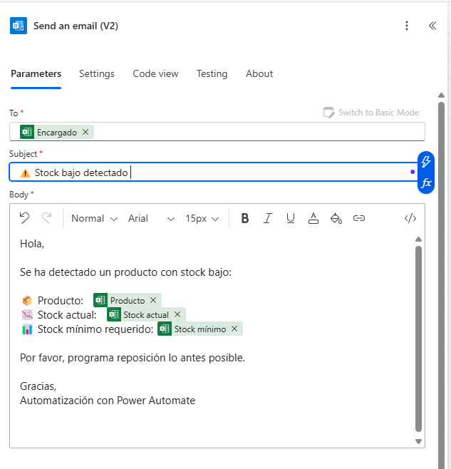

### Tarea 7. Realizar prueba del flujo

Paso 1. Dar clic en "Save".
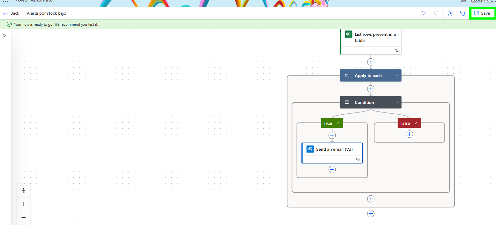

Paso 2. Seleccionar la opción "Test" y hacer clic en "Manually".

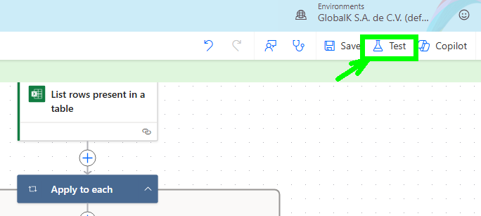

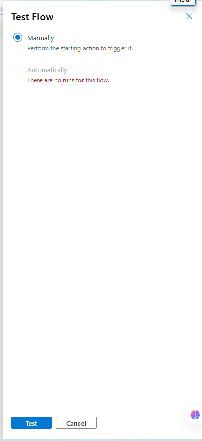

Paso 3. Dar clic en "Run Flow".

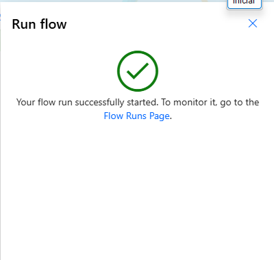

Paso 4. Se observa que todo el flujo corre de manera correcta.

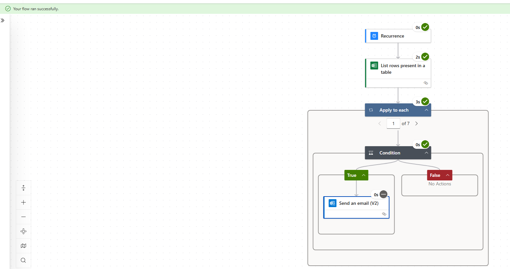

### Resultado esperado
Si el stock actual es menor que el mínimo, se enviará un correo de alerta.

El correo tendrá los datos del producto y niveles de inventario.

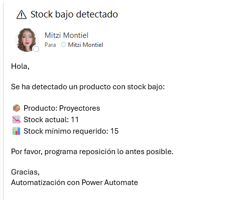
