# Práctica 6. Aplicación de DAX para análisis de ventas y servicio

## Objetivo de la práctica:
Al finalizar la práctica, serás capaz de:

- Aplicar funciones clave de DAX como CALCULATE, FILTER, DIVIDE y AVERAGEX para resolver necesidades de negocio relacionadas con el análisis de propinas por mesero y ventas por tipo de producto. El participante comprenderá cómo filtrar contextos y crear medidas relevantes para análisis operativos.

## Duración aproximada:
- 20 minutos.

## Escenario: 

Trabajas en el área de análisis de un restaurante. El gerente general solicita un informe donde pueda ver:

- Cuánto ha recaudado cada mesero en propinas.
- Quién tiene mejor promedio de propina por pedido.
- Cuánto se ha vendido por tipo de producto (Comida vs Bebida).
- Cuánto se ha vendido exclusivamente en productos de comida con precio menor a $100.

## Instrucciones 

### Tarea 1. Cargar la base de datos de Excel a Power Pivot

Paso 1. Descargar el archivo llamado: [Practica Modulo 6](<Práctica Modulo 6.xlsx>).

Paso 2. Dirigirse a la parte superior en Power Pivot y seleccionar "Agregar a modelo de datos".

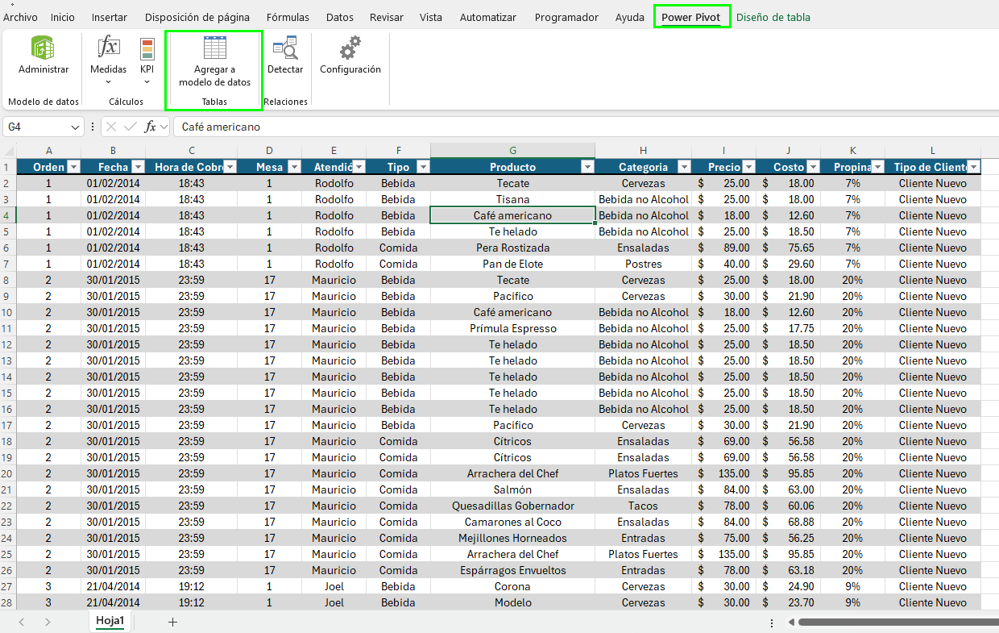

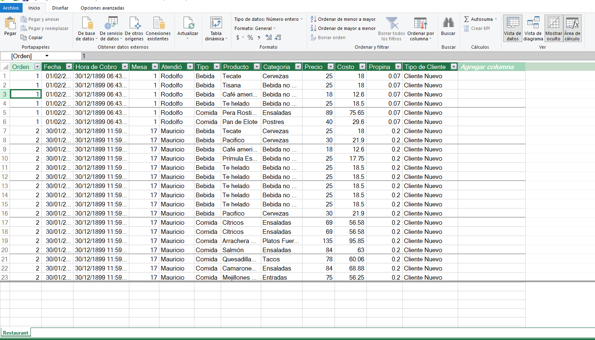


### Tarea 2. Crear las medidas DAX

Paso 1. Posicionarse en el área de cálculo.

Paso 2. Para poder calcular el "Total de propinas por mesero", utilizar la siguiente fórmula.

```
TotalPropinas:=SUM(Restaurant[Propina])
```

Paso 3. Al calculo realizado darle el formato de moneda.

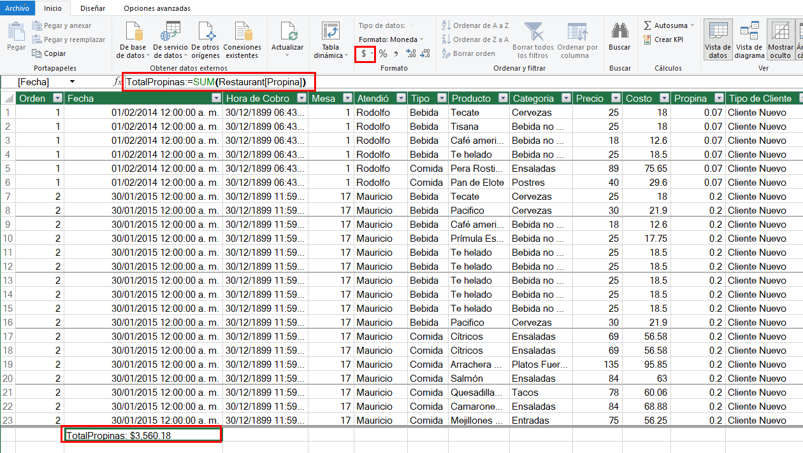


Paso 4. Para calcular el promedio de propina por pedido (orden). Escribir la siguiente fórmula:

```
PromedioPropina:=AVERAGEX(
    VALUES(Restaurant[Orden]),
    CALCULATE(SUM(Restaurant[Propina]))
)
```

Paso 5. Al calculo realizado darle el formato de moneda.

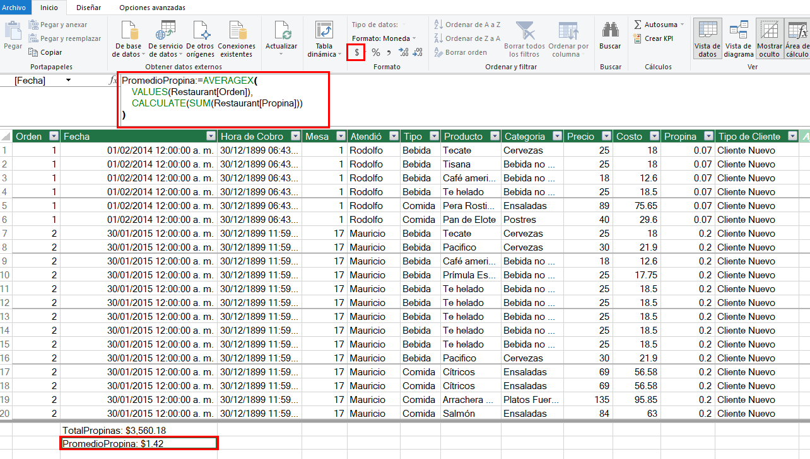

Esto calcula el promedio por pedido (Orden), agrupando todos los registros con el mismo número de orden.

Paso 6. Calcular el Total de ventas por tipo de producto.

```
VentasTotales:=SUM(Restaurant[Precio])
```

Paso 7. Aplicar el formato moneda.

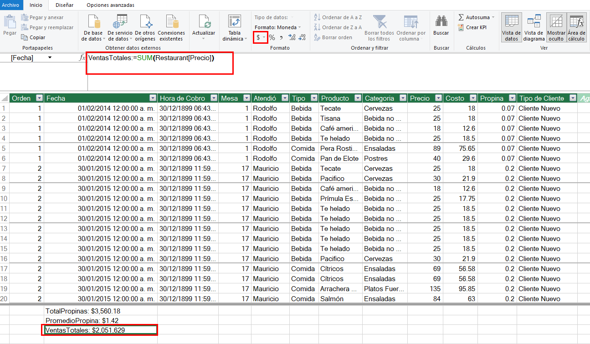

Paso 8. Calcular las ventas de comina con precio menor a $100.

```
VentasComidaMenor100:=CALCULATE(
    [VentasTotales],
    FILTER(
        Restaurant,
        Restaurant[Tipo] = "Comida" &&
        Restaurant[Precio] < 100
    )
)
```

Paso 9. Aplicar el formato moneda.

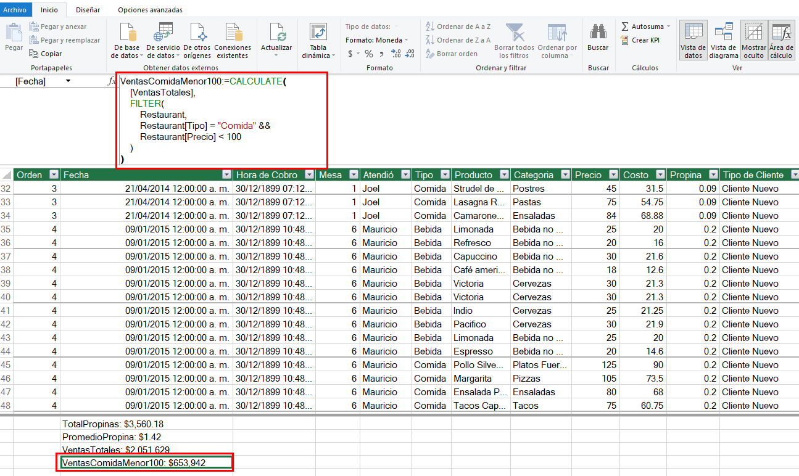

Filtrar toda la tabla Restaurant para solo incluir productos tipo Comida con precio menor a 100.


### Tarea 3. Realizar tablas dinámicas

Paso 1. En la interfaz de Power Pivot seleccionar "Tabla dinámica" en una nueva hoja. 

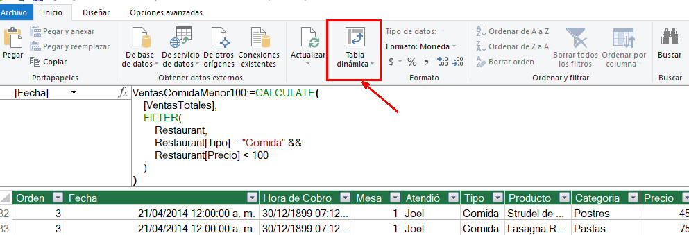

Paso 2. Realizar la primera tabla de las "Propinas por mesero".

Filas --> Restaurant[Atendió]
Valores --> Total Propinas

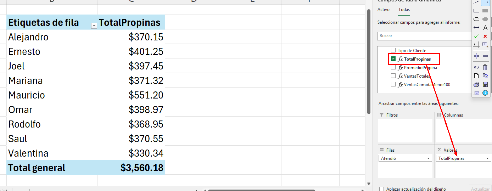

Paso 3. Ahora, agregar el promedio por pedido (orden). Seleccionar la medida de "PromedioPropina" para asignarla al campo valores.

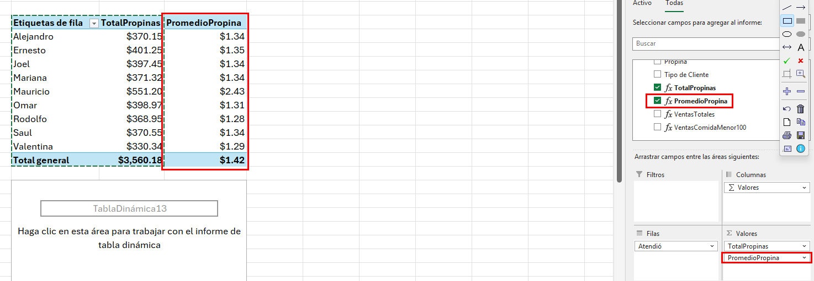

Paso 4. Copiar y pegar esa tabla dinamica, limpiar todos los campos y después, estructurar las ventas por tipo.

Filas --> Restaurant[Tipo]
Valores --> VentasTotales

Se tiene que las ventas totales fueron de $2,051,629.

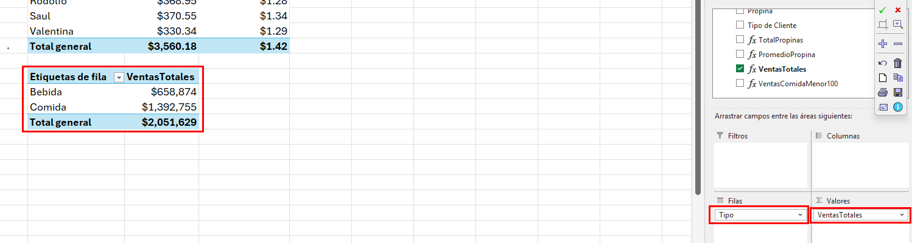

Paso 5. Agregar a la tabla la medida que se realizo de VentasComidaMenor100.

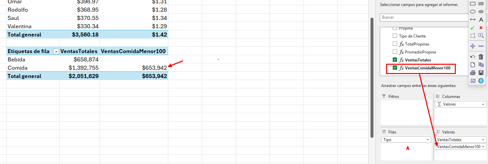

### Resultado esperado

En el análisis realizado, se identificó que el total recaudado en propinas entre todos los meseros fue de $3,560.18, siendo Mauricio quien destacó significativamente con $551.20, la cifra más alta individual. Además, al evaluar el promedio de propina por pedido, Mauricio nuevamente lidera con un promedio de $2.43, muy por encima del promedio general de $1.42, lo cual sugiere un desempeño destacado en atención al cliente o tipo de servicio brindado. En cuanto a las ventas por tipo de producto, se determinó que la comida generó $1,392,755, representando la mayor parte del ingreso frente a las bebidas con $658,874. Finalmente, se observó que dentro de las ventas de comida, los productos con precio menor a $100 representaron un volumen importante, alcanzando un total de $653,942, lo cual evidencia una alta demanda de opciones accesibles dentro del menú.

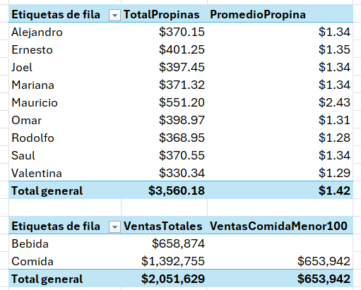
