# Análisis de Ventas con Copilot e Inteligencia Artificial

## Objetivo de la práctica:
Al finalizar la práctica, serás capaz de:
- Generar fórmulas complejas automáticamente utilizando lenguaje natural con Copilot.
- Solicitar análisis de KPIs como ventas promedio por región o por categoría, y segmentaciones por vendedor.
- Automatizar tareas repetitivas como filtrado de datos, resúmenes y limpieza utilizando prompts inteligentes.

## Duración aproximada:
- 15 minutos.

## Instrucciones 

### Tarea 1. Lenguaje natural para fórmulas:
Paso 1. Abre el archivo llamado [Registro de ventas](<Registro de ventas.xlsx>)

Paso 2. Pidele a copilot lo siguiente: “Muéstrame el total de ventas por región”

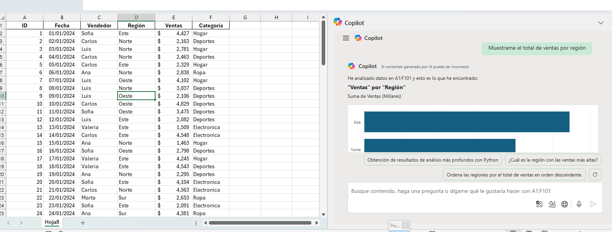

Paso 3. Seleciconamos la opción que dice "Agregar a una hoja nueva"

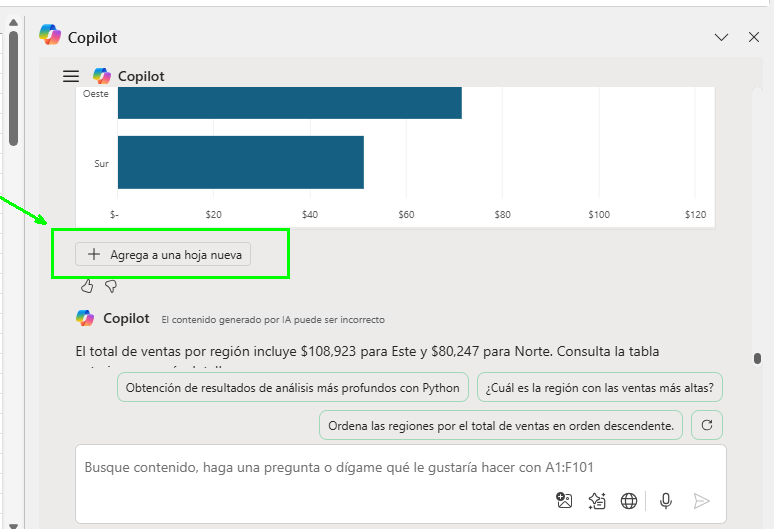

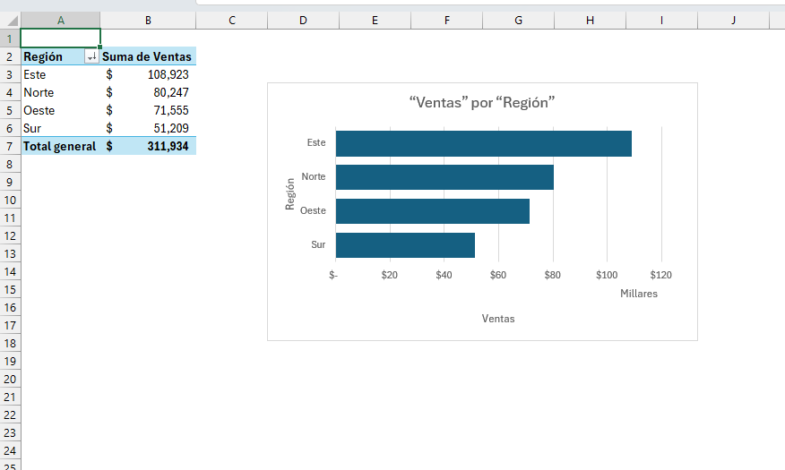

Paso 3. ahora pidele a copilot lo siguiente : "Calcula el promedio de ventas por categoría”

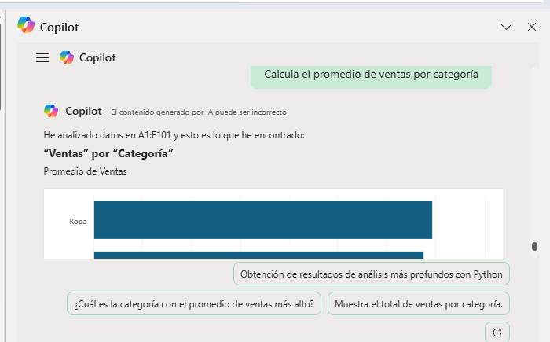

Paso 4. Vamos ahora insertar los datos en una hoja nueva

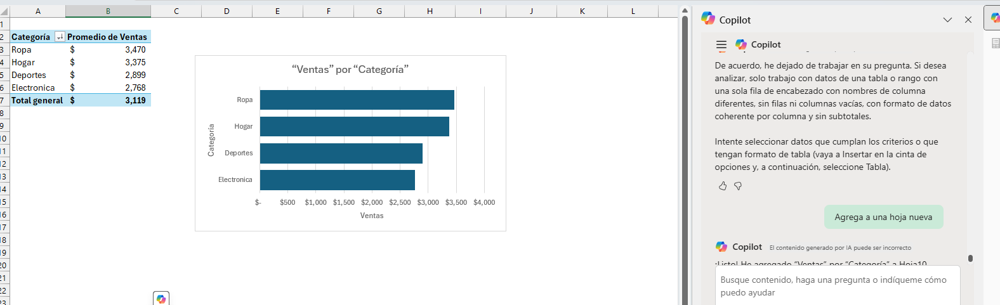

### Tarea 2. Análisis de KPIs

Paso 1. Pide a Copilot:
“Genera una tabla con el top 3 de vendedores por volumen de ventas”

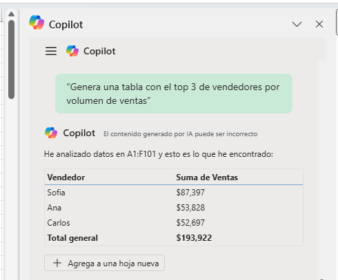

Paso 2. Agrega esa información a una hoja nueva

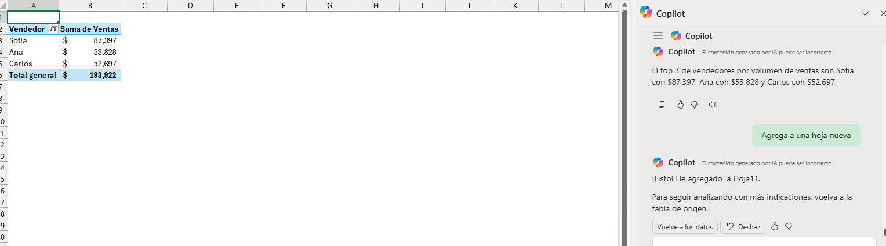

Paso 3: Pedirle a copilot: "Segmenta los datos por región y muestra las ventas promedio" e insertar en una hoja nueva.

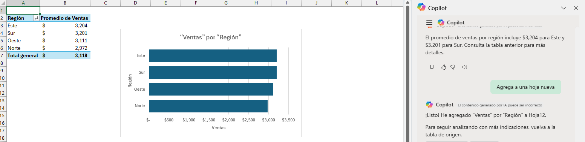

### Tarea 3. Automatización con Copilot

Paso 1. Pedirle a Copilot lo siguiente: "Filtra los registros donde las ventas sean mayores a 4000" y aplica el flitro

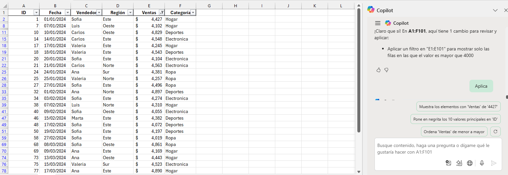

Paso 2. Pedirle a Copilot lo siguiente: “Resume las ventas semanales por categoría” y agrega a una hoja nueva

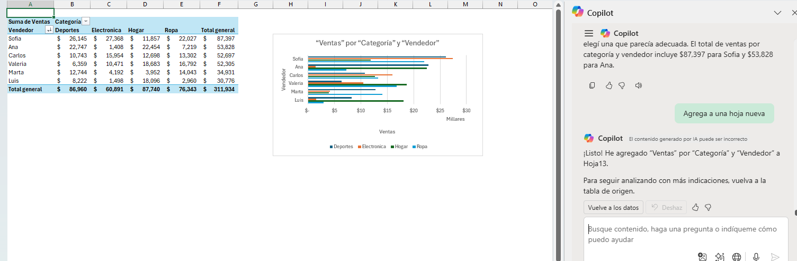

### Tarea 4. Crear la medida DAX automáticamente

Paso 1. Pedirle a copilot: “Crea una medida DAX que calcule el promedio de ventas por vendedor y agrégala a una tabla dinámica.”

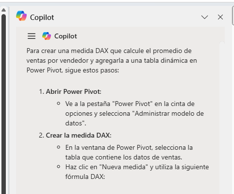

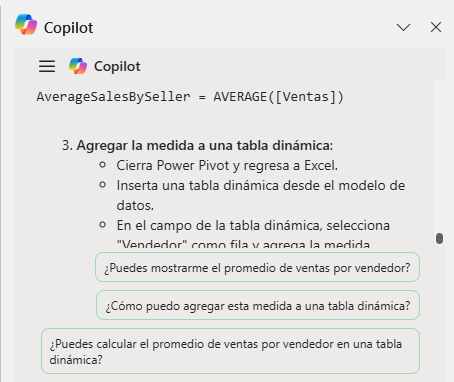

Paso 2: Sigue los pasos que te dio copilot

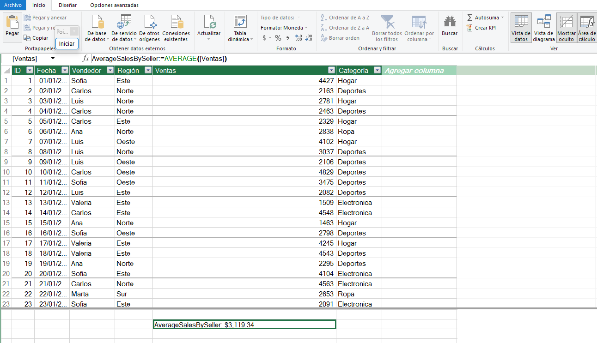

### Resultado esperado

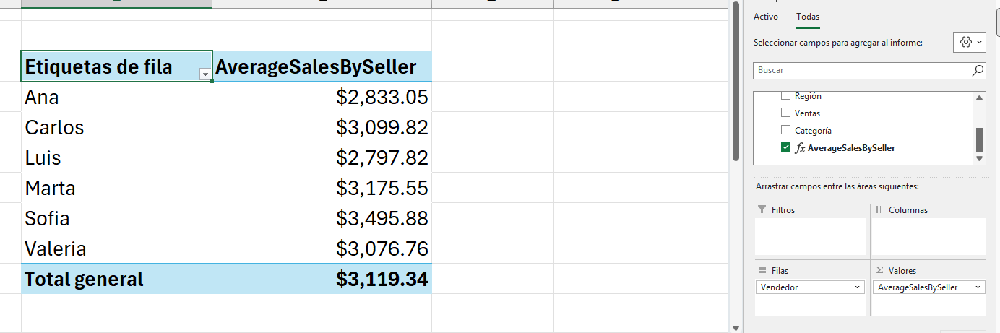
